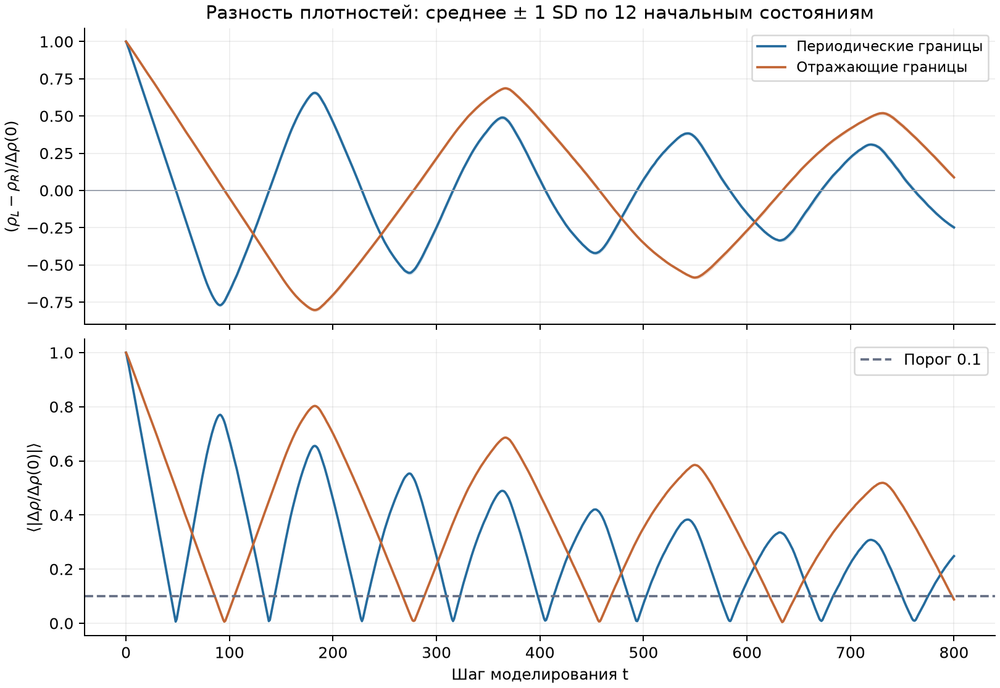
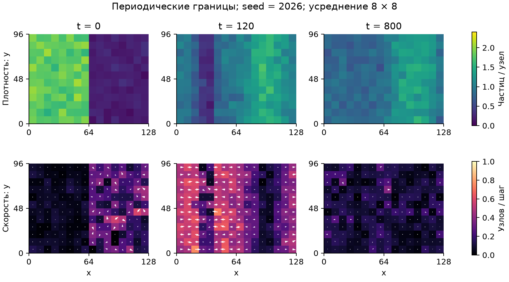
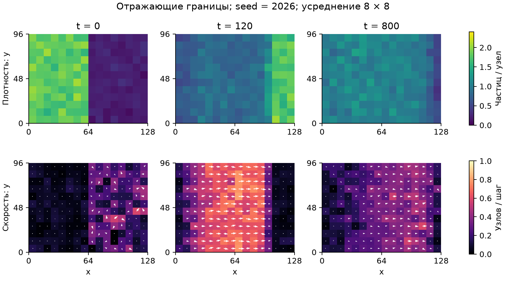
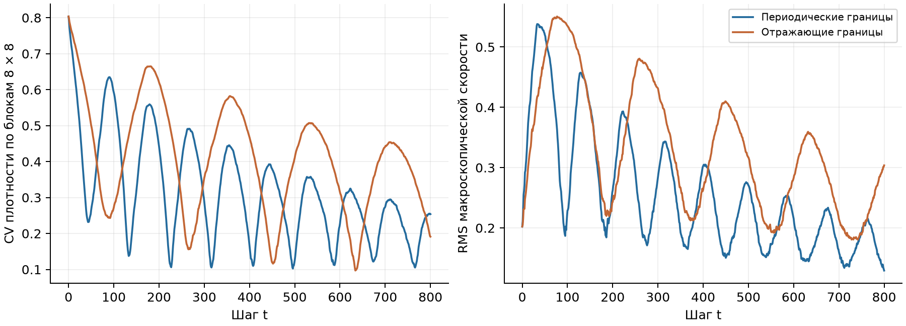

# Исследование модели HPP: перераспределение плотности газа и влияние граничных условий

Растегаев Алексей Эдуардович, СМ6-91.

МГТУ им. Н. Э. Баумана; кафедра СМ6; Компьютерное моделирование.

Преподаватель: Федулов В. А. Москва, 2026.

Исходный код: https://github.com/Sarven505/hpp-lattice-gas

Министерство науки и высшего образования Российской Федерации

Федеральное государственное автономное образовательное учреждение высшего образования

«Московский государственный технический университет имени Н. Э. Баумана
(национальный исследовательский университет)»

ФАКУЛЬТЕТ «СПЕЦИАЛЬНОЕ МАШИНОСТРОЕНИЕ»

КАФЕДРА «РАКЕТНЫЕ И ИМПУЛЬСНЫЕ СИСТЕМЫ» (СМ6)

ОТЧЁТ ПО ЛАБОРАТОРНОЙ РАБОТЕ

По дисциплине «Компьютерное моделирование»

Исследование модели HPP: перераспределение плотности газа и влияние граничных условий

Выполнил: студент группы СМ6-91
**Растегаев Алексей Эдуардович**

Проверил: **Федулов В. А.**

Москва, 2026 г.

## 1. Постановка задачи

Исходный код и данные экспериментов: [https://github.com/Sarven505/hpp-lattice-gas](https://github.com/Sarven505/hpp-lattice-gas).

Исследуется модель решётчатого газа HPP D2Q4, предложенная в лекции 4. Выбранная особенность темы - влияние граничных условий на перераспределение первоначально неоднородного газа в прямоугольной области. Сравниваются периодическое замыкание области и отражение от неподвижных стенок.

### 1.1. Цель и измеримые задачи

**Цель:** за 800 шагов измерить изменение разности средних плотностей между половинами области, сравнить два типа границ по ансамблю из 12 начальных состояний и проверить точное сохранение массы и корректный баланс импульса.

1. Формализовать состояния узлов, столкновения, перенос и граничные условия.

2. Реализовать синхронную модель с управлением через командную строку.

3. Проверить все локальные состояния, теоретические инварианты и обратимость.

4. Выполнить парные эксперименты с одинаковыми начальными массивами для двух границ.

5. Построить карты плотности и скорости; проанализировать динамику и ограничения.

### 1.2. Допущения и единицы

Пространство и время дискретны: шаг решётки и длительность такта приняты равными единице. Частицы одинаковы; в каждом направленном канале узла допускается не более одной частицы. Внешние силы, диагональные скорости, температура, случайное рассеяние и добавленное затухание отсутствуют. Случайность используется только для начального заполнения, последующая эволюция детерминирована.

Плотность измеряется числом частиц на узел, скорость - числом шагов решётки за такт. Физическая калибровка на конкретный газ не выполняется. Требование количественного совпадения с реальным течением в этой работе не ставится.

## 2. Формализация клеточного автомата

Состояние решётки задаётся булевым массивом n(y, x, i) формы (H, W, 4). Направления i=0,1,2,3 соответствуют востоку, северу, западу и югу; y возрастает вверх на рисунках. Используется окрестность фон Неймана.

$$ \mathbf{c}_0=(1,0),\quad \mathbf{c}_1=(0,1),\quad \mathbf{c}_2=(-1,0),\quad \mathbf{c}_3=(0,-1) \quad (1) $$

### 2.1. Столкновение

В узле ровно две встречные частицы разлетаются по двум перпендикулярным направлениям. При наличии третьей или четвёртой частицы это правило не применяется. Все изменения вычисляются по старому массиву, поэтому обновление синхронно.

$$ n_i^*=n_i-n_i n_{i+2}(1-n_{i+1})(1-n_{i+3})+(1-n_i)(1-n_{i+2})n_{i+1}n_{i+3} \quad (2) $$

В формуле (2) индексы направлений рассматриваются по модулю 4. Астериск обозначает состояние после столкновения, до переноса.

Таблица 1. Полная классификация 16 локальных состояний

| Входящие каналы | Выходящие каналы | Число вариантов |

|---|---|---|

| Только восток и запад | Север и юг | 1 |

| Только север и юг | Восток и запад | 1 |

| Пустой узел; одна частица; перпендикулярная пара; три или четыре частицы | Без изменений | 14 |

### 2.2. Перенос

$$ n_i(\mathbf{r}+\mathbf{c}_i,t+1)=n_i^*(\mathbf{r},t) \quad (3) $$

При периодических границах координаты назначения берутся по модулю W и H. При выходе за отражающую границу частица остаётся в исходном узле и занимает противоположный канал: восток ↔ запад, север ↔ юг. Отражение занимает один такт; стенка проходит между крайним узлом и внешним пространством.

Каждый направленный канал имеет ровно одно назначение и один источник. Перенос и отражение являются перестановками каналов: частицы не теряются и не объединяются.

## 3. Наблюдаемые величины и законы сохранения

$$ \rho(\mathbf{r},t)=\sum_{i=0}^{3}n_i(\mathbf{r},t),\quad \mathbf{j}(\mathbf{r},t)=\sum_{i=0}^{3}n_i(\mathbf{r},t)\mathbf{c}_i \quad (4) $$

$$ N(t)=\sum_{\mathbf{r}}\rho(\mathbf{r},t),\quad \mathbf{P}(t)=\sum_{\mathbf{r}}\mathbf{j}(\mathbf{r},t) \quad (5) $$

Столкновение меняет только две пары с нулевым суммарным импульсом. Поэтому оно сохраняет массу и импульс в каждом узле. Перенос сохраняет массу глобально; периодические границы сохраняют и глобальный импульс.

$$ N(t)=N(0),\qquad \mathbf{P}(t)-\mathbf{P}(0)=\sum_{\tau=0}^{t-1}\mathbf{I}_{\mathrm{wall}}(\tau) \quad (6) $$

При отражении изменение импульса одной частицы равно -2cᵢ. На каждом шаге подсчитывается импульс от всех отражений. Для периодической области правая часть формулы (6) равна нулю. Балансы вычисляются целочисленно, без допуска на округление.

### 3.1. Пространственное усреднение

Для карт используются неперекрывающиеся блоки B размером 8 × 8. Сначала суммируются населённости, затем вычисляется скорость, взвешенная по массе:

$$ \rho_B=\frac{1}{|B|}\sum_{\mathbf{r}\in B}\rho(\mathbf{r}),\qquad \mathbf{u}_B=\frac{\sum_{\mathbf{r}\in B}\mathbf{j}(\mathbf{r})}{\sum_{\mathbf{r}\in B}\rho(\mathbf{r})} \quad (7) $$

Если блок пуст, его скорость принимается равной нулю. Усреднение подавляет шум отдельного узла. Даже при нулевом ожидаемом начальном потоке измеренная RMS-скорость не равна нулю из-за конечной выборки частиц.

$$ \Delta\rho(t)=\overline{\rho}_L(t)-\overline{\rho}_R(t),\quad d(t)=\frac{\Delta\rho(t)}{\Delta\rho(0)} \quad (8) $$

$$ CV_\rho=\frac{\mathrm{std}_B(\rho_B)}{\mathrm{mean}_B(\rho_B)},\qquad u_{\mathrm{RMS}}=\sqrt{\frac{1}{K}\sum_{B=1}^{K}|\mathbf{u}_B|^2} \quad (9) $$

CV и RMS здесь усредняются равновесно по пространственным блокам. На ансамблевом графике показываются среднее знаковое d(t) и среднее |d(t)|; последнее предотвращает ложное выравнивание из-за взаимного сокращения разных реализаций.

## 4. Реализация и проверка модели

Программа написана на Python. NumPy выполняет операции над булевыми массивами; Matplotlib строит графики; argparse формирует интерфейс командной строки; pytest выполняет автоматические проверки. Модули динамики, экспериментов, визуализации и интерфейса разделены.

### 4.1. Алгоритм одного шага

Инициализация → измерение начального состояния → столкновение → подсчёт импульса стенок → перенос → измерение и проверка балансов → сохранение результатов. Цикл повторяется заданное число раз. При ненулевой ошибке баланса расчёт останавливается.

Листинг 1. Проверка баланса импульса в вычислительном цикле

```python
post_collision = collide(state)
impulse += wall_impulse(post_collision, boundary)
state = stream(post_collision, boundary)
# Баланс импульса с учётом обмена со стенками
error = momentum(state) - momentum0 - impulse
if np.any(error):
    raise RuntimeError("Momentum balance failed")
```

### 4.2. Верификация и теоретическая валидация

Таблица 2. Проверки реализации: 30 тестов пройдены

| Группа проверок | Критерий |

|---|---|

| Все 16 локальных состояний | Правило столкновения; точные масса и импульс; двойное столкновение возвращает исходное состояние |

| Независимая скалярная модель | Полное совпадение массивов на 15 шагах для каждой границы |

| Обратимость | 100 прямых и 100 обратных шагов возвращают весь исходный массив |

| Одна частица | Точный период W на торе и 2W между отражающими стенками |

| Поля, начальные условия, ввод | Взвешенная скорость, пустые блоки, биномиальные характеристики, повторяемость seed, ошибочные параметры |

Верификация подтверждает соответствие программе правилу HPP. Теоретическая валидация ограничена известными дискретными результатами: инвариантами, обратимостью и движением одной частицы. Экспериментальных данных реального газа для физической валидации не использовано.

## 5. Методика вычислительного эксперимента

В начальный момент каждый канал заполняется независимо с вероятностью 0.45 в левой половине и 0.05 в правой. Ожидаемые плотности половин равны 1.8 и 0.2; ожидаемая средняя плотность равна 1.0. Ожидаемый глобальный импульс равен нулю, но конкретная конечная выборка может иметь небольшой ненулевой импульс.

Таблица 3. Параметры серии

| Параметр | Значение |

|---|---|

| Размер поля | W = 128, H = 96 |

| Длительность | 800 шагов; измерение на каждом шаге |

| Ансамбль | 12 seed: 2026-2037; две границы; всего 24 расчёта |

| Начальные вероятности каналов | pL = 0.45; pR = 0.05 |

| Усреднение полей | Неперекрывающиеся блоки 8 × 8 |

| Поздний интервал статистики | Последние 100 шагов: t = 701-800 |

| Критерий временного сближения | Среднее |d(t)| ≤ 0.1 на 25 последовательных шагах |

Для каждого seed исходный массив одинаков в двух вариантах границ. Это парный дизайн: различия внутри пары обусловлены границей, а не начальным заполнением. У периодической области есть два стыка между половинами: центральный и через край x=0/W. У отражающей области обмен между половинами возможен только через центральный стык.

Для поздних показателей сначала берётся среднее за t=701-800 отдельно в каждом расчёте, затем среднее и выборочное стандартное отклонение SD по 12 расчётам. SD характеризует разброс начальных состояний, а не доверительный интервал и не разброс 100 коррелированных временных точек.

Для снимков поля используется seed=2026. Его фактическое число частиц N=12327 отличается от математического ожидания 12288. Исходный импульс равен (49, -8); начальная разность плотностей составляет 1.600749.

Порог на 25 шагах используется только как локальный диагностический показатель: последующее превышение порога разрешено. Для доказательства устойчивого равновесия потребовались бы существенно более длинный горизонт и отдельный критерий стабильности.

## 6. Динамика перераспределения плотности



Наблюдается смена знака разности плотностей, то есть перенос газа из левой половины в правую и обратно. Амплитуда колебаний снижается, но не исчезает за 800 шагов. Среднее абсолютное значение подтверждает, что близость среднего к нулю в отдельные моменты не означает прекращение движения.

Положительные максимумы ансамблевой кривой для периодических границ располагаются около t=182, 364, 543, 720. Для отражающих границ максимумы наблюдаются около t=367 и 731. Оценка периода по поздним максимумам составляет примерно 180 и 364 шага соответственно. Это описательная оценка для данной сетки и амплитуды возмущения, а не универсальная константа HPP.

Первое окно из 25 шагов ниже порога начинается в t=750 для периодических и t=622 для отражающих границ. После такого окна колебания возвращаются; поэтому по этим числам нельзя заключить, что отражающие границы быстрее приводят газ к равновесию.

## 7. Пространственные поля плотности и скорости





В газе сохраняются полосы плотности и направленного потока. Периодические границы пропускают возмущения через край, а отражающие возвращают их внутрь области. Цвет показывает плотность или модуль усреднённой скорости; стрелки - направление потока.

## 8. Численные результаты и баланс импульса

Таблица 4. Среднее ± SD по 12 начальным состояниям

| Показатель за t=701-800 | Периодические | Отражающие |

|---|---|---|

| Среднее |Δρ|, частиц/узел | 0.287720 ± 0.005875 | 0.593613 ± 0.010993 |

| CV плотности по блокам | 0.216475 ± 0.003611 | 0.374704 ± 0.004592 |

| RMS скорости, узлов/шаг | 0.166617 ± 0.002089 | 0.220809 ± 0.001800 |

| Максимальная ошибка массы | 0 | 0 |

| Максимальная ошибка баланса импульса | 0 | 0 |



В выбранном позднем интервале периодические границы дают меньшую среднюю разность плотностей и меньший CV. Однако интервал зависит от фазы колебаний, поэтому результат нельзя распространять на любое время и любые начальные условия.

Для seed=2026 при t=800: периодические границы дают N=12327 и P=(49,-8); отражающие дают N=12327 и P=(3197,-58). В последнем случае накопленный импульс стенок равен (3148,-50), что точно совпадает с P(800)-P(0). Изменение импульса газа при отражении не является ошибкой сохранения.

## 9. Обсуждение и заключение

### 9.1. Интерпретация и ограничения

Колебания связаны с распространением и возвращением возмущений в конечной замкнутой области. Отличие периодов согласуется с разной геометрией прохождения поля: периодический край соединяет противоположные стороны, отражающий меняет направление движения. Само наличие такого соответствия не заменяет отдельный вывод дисперсионных характеристик автомата.

Четыре разрешённых направления на квадратной сетке не обеспечивают полной вращательной изотропии. Эта работа использует ступенчатую неоднородность вдоль x и не измеряет угловую анизотропию непосредственно. Для такой проверки нужен отдельный эксперимент, например разлёт кругового облака.

Динамика HPP обратима. Уменьшение наблюдаемой амплитуды и пространственное усреднение не доказывают необратимую термодинамическую релаксацию. Проверка обратного шага реализует правильный порядок операторов: если прямой шаг F=SC, то обратный F⁻¹=CS⁻¹.

12 seed проверяют устойчивость выводов к случайному начальному заполнению на одной сетке. Сходимость при изменении размера поля, более длинные горизонты и физическая калибровка не исследованы. Величины плотности и скорости являются численными аналогами, предусмотренными заданием.

### 9.2. Выводы

1. Реализована синхронная модель HPP D2Q4 с периодическими и отражающими границами, интерфейсом запуска и сохранением всех измеренных данных.

2. Все 30 тестов пройдены. В 24 экспериментах точное сохранение массы и баланс импульса с учётом стенок выполнялись на каждом шаге без численной погрешности.

3. Границы изменяют период и амплитуду перераспределения газа. В заданном позднем интервале среднее |Δρ| равно 0.287720 ± 0.005875 для периодических и 0.593613 ± 0.010993 для отражающих границ.

4. В течение 800 шагов сохраняются затухающие колебания. Кратковременное сближение средних плотностей не позволяет заявить об установившемся равновесии. Цель количественного сравнения границ и проверки модели достигнута.

## 10. Воспроизведение и источники

### 10.1. Воспроизведение

Требуется Python 3.10 или новее. В корне репозитория устанавливаются зависимости из requirements-dev.txt; команда python -m pytest -q запускает проверки. Команда ниже повторяет численные эксперименты с теми же параметрами:

python -m hpp study --width 128 --height 96 --steps 800 --seeds 12 --block 8 --output results/study

Исходные параметры, агрегированные итоги, CSV каждого расчёта, ансамблевые CSV, массивы состояний и рисунки сохранены в experiments/. PDF генерируется командой python report/build_report.py --output report/hpp_report.pdf. В README приведены инструкции для Windows, macOS и Linux, справка по всем параметрам и структура выходных файлов.

### 10.2. Источники

[1] Материалы курса: «Лекция 4 - Решётчатый газ». Разделы 3 (состояния и фазы), 4.1 (модель HPP), 5.1 (темы и требования к исследованию). Предоставленный PDF, 12 с.

[2] Материалы курса: «О выполнении заданий по курсу». Разделы 4-5: структура работы, проверка модели, документация и отчётность. Предоставленный PDF, 5 с.

[3] Материалы курса: «Лекция 3 - Клеточные автоматы». Разделы 1-2: дискретность, синхронность, окрестности и граничные условия. Предоставленный PDF, 22 с.

[4] Пример структуры HPP-проекта: [github.com/golichnicov/hpp_lattice_gas](https://github.com/golichnicov/hpp_lattice_gas). Использован как пример состава репозитория; код и данные не заимствованы.

[5] Пример оформления и реквизитов: [github.com/alexanderchekhov8-wq/lab1.1](https://github.com/alexanderchekhov8-wq/lab1.1), титульный лист «Отчет по лабораторной работе 1.pdf». ФИО и группа этого отчёта заданы отдельно.

Вуз, кафедра, название дисциплины и преподаватель взяты из титульного листа [5]. Наблюдаемые результаты и численные таблицы получены расчётами данного проекта.
